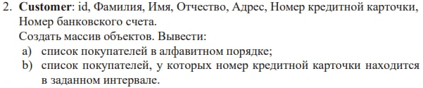

Гаврилюк Максим ІПС-31 Варіант 2

<ui>
<li>Task2CutomerStructure - містятся класи Customer та Customers, який зберігає множину  Customer</li>
<li>SocketUsing - містится SocketServer та SocketClient</li>
<li>RMIUsing - містится RMIServer та RMIClient</li>
</ui>

